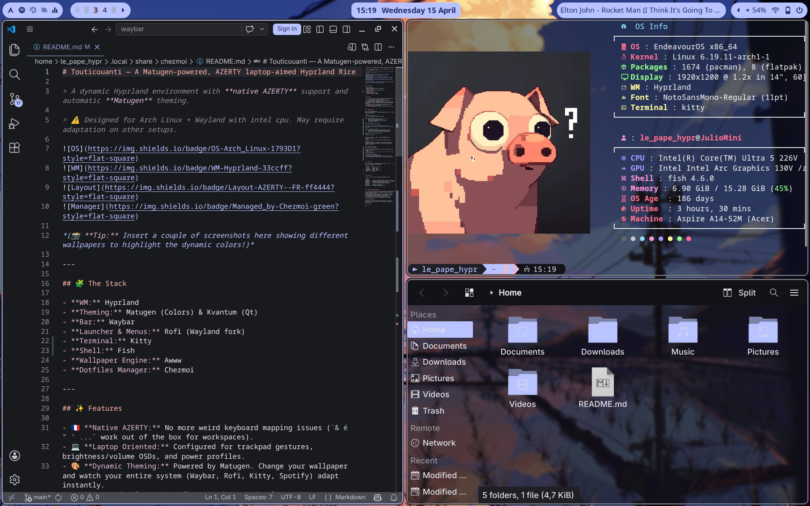
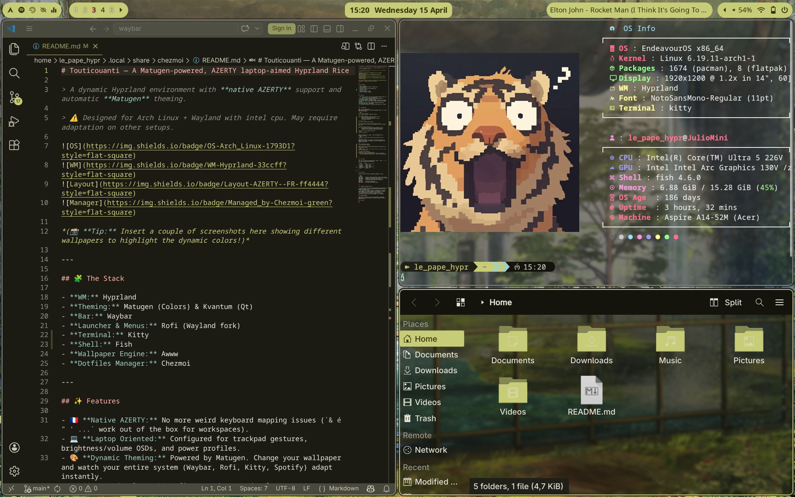

<div align="center">

# Touticouanti 🎨

**A Matugen-powered, AZERTY-first Hyprland rice for Intel laptops**


  
  

### 🎥 Live Demo (Dynamic Theming & Rofi)

[https://github.com/Zulio-b/dotfiles/assets/demo.mp4
](https://github.com/Zulio-b/dotfiles/assets/188205490/578666122-c7f8a5cb-30b6-4766-ade3-80ed56384692.mp4)

</div>
---

## 🧩 Stack

| Role | Tool |
|---|---|
| Window Manager | Hyprland |
| Bar | Waybar |
| Launcher | Rofi (Wayland fork) |
| Terminal | Kitty |
| Shell | Fish + Starship |
| Theming Engine | Matugen + Kvantum |
| Wallpaper | Awww |
| Notifications | Swaync |
| Dotfiles Manager | Chezmoi |
---

## ✨ Features

- 🇫🇷 **Native AZERTY:** No more weird keyboard mapping issues classic workflow binds work out of the box for workspaces.
- 🎨 **Dynamic Theming** — change your wallpaper, Matugen regenerates colors across Waybar, Rofi, Kitty and Spotify instantly
- 💻 **Laptop-first** — trackpad gestures, brightness/volume OSDs, power profiles
- ⌨️ **Rofi Command Palette** — apps, calculator, power menu, cheat sheet all in one
- ⚙️ **One-command deployment** — chezmoi handles everything

> ⚠️ Designed for **Arch Linux + Wayland + Intel GPU**. Nvidia may require additional setup (see [Hyprland wiki](https://wiki.hyprland.org/Nvidia/)).

---

## 🚀 Installation

### 1. Install dependencies

```bash
# Core & Window Manager
yay -S --needed hyprland awww-git matugen-bin chezmoi

# UI, Fonts & Theming
yay -S --needed waybar rofi wlogout swaync \
       nwg-look qt5ct qt6ct kvantum \
       bibata-cursor-theme-bin papirus-icon-theme \
       ttf-jetbrains-mono-nerd

# Terminal & Shell
yay -S --needed kitty fish starship fastfetch

# System & Hardware
yay -S --needed pavucontrol-qt blueman power-profiles-daemon btop htop

# Apps, Utilities & Hyprland ecosystem
yay -S --needed firefox dolphin spotify-launcher spicetify-cli cava \
       swayosd-git hyprlock hypridle hyprsunset hyprpicker \
       grimblast-git wl-clipboard cliphist playerctl dunst \
       xdg-desktop-portal-hyprland polkit-gnome rofi-calc rofimoji
```

### 2. Apply dotfiles

```bash
chezmoi init --apply https://github.com/Zulio-b/dotfiles.git
```

### 3. Set fish as default shell

```bash
chsh -s /usr/bin/fish
```

### 4. Log out and launch Hyprland

Select Hyprland from your display manager, or run:
```bash
Hyprland
```

Once in, press `SUPER + SHIFT + W` to pick a wallpaper and let Matugen do its thing 🎨

---
## 🛠️ Post-Install

### Spotify theming

```bash
spotify-launcher   # Run once to initialize
spicetify backup apply
```

### VSCode theming

Install `ext install HyprLuna.hyprluna-theme` from the marketplace for Matugen-synced colors.

---


## 🎮 Shortcuts

Don't want to memorize everything? Press `SUPER` + `SHIFT` + `?` to open the interactive Rofi Cheat Sheet!

| Action      | Key                 |
| ----------- | ------------------- |
| Terminal    | `SUPER + Enter`     |
| Launcher    | `SUPER + Space`     |
| Wallpaper   | `SUPER + SHIFT + W` |
| Cheat Sheet | `SUPER + SHIFT + ?` |
| Workspaces (AZERTY) | `SUPER + & é " ' ( - è _ ç` |
| Lock Screen | `SUPER + L` |
| Close       | `SUPER + Q`         |

---


## 📂 Structure

```
~/.config/
├── hypr/         # Keybinds, window rules, startup
├── matugen/      # Color templates for the whole system
├── waybar/       # Bar modules and styling
├── rofi/         # Launcher, cheat sheet, calculator, power menu
├── kitty/        # Terminal config
└── Kvantum/      # Qt theming engine
```

---

## 🖥️ Tested On

| | |
|---|---|
| CPU | Intel Core Ultra 5 226V |
| GPU | Intel Arc (integrated) |
| Resolution | 1920×1080 |
| Kernel | linux / linux-zen |

---

## 🗺️ Roadmap

- [ ] Alternative icon/UI theme with full Matugen sync
- [ ] On-the-fly AZERTY ↔ QWERTY layout toggle
- [ ] Smart animations and behaviour based on power state

---
## 🙏 Acknowledgement

Huge thanks to the entire Linux ricing community. I have used, learned from, and been inspired by so many incredible dotfiles from [/unixporn](https://www.reddit.com/r/unixporn/) to build this one.

## 📜 License

MIT
