# Touticouanti 🎨

## A Hyprland config, tailored for AZERTY laptops on Arch based Linux.

[](https://archlinux.org)
[-33ccff?style=flat-square)](https://hyprland.org)
[](#-keybindings)
[](https://chezmoi.io)

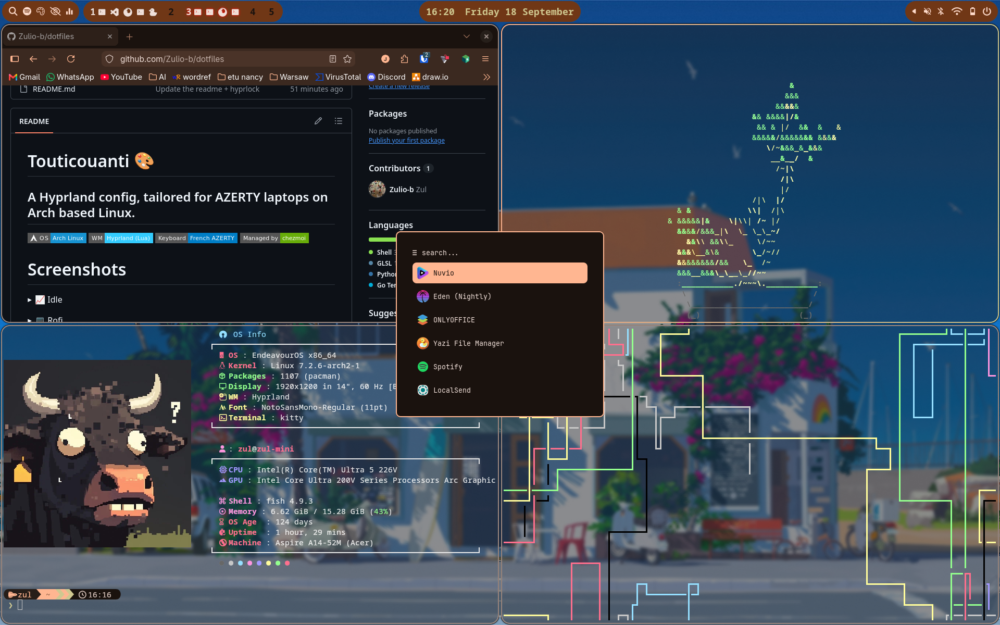

# Screenshots

<details>
<summary>📈 Idle</summary>
<h4 align="center"> Idle </h4>

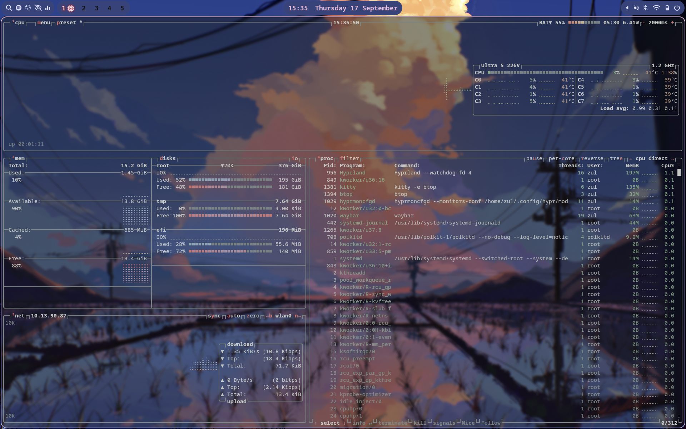
</details>

<details>
<summary>💻 Rofi</summary>

<h4 align="center"> Menu </h4>

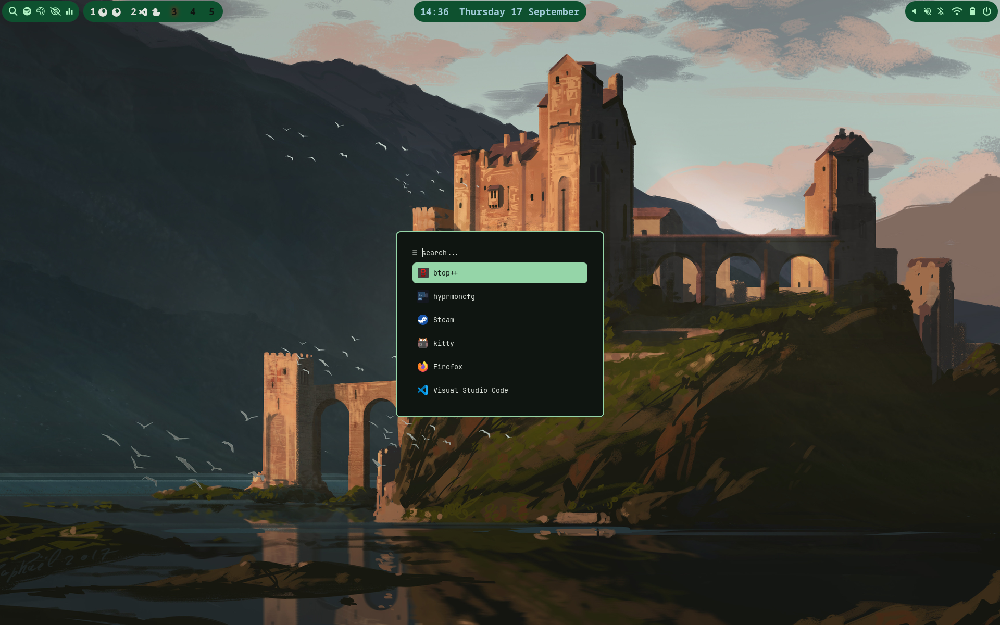

<h4 align="center"> Wallpaper Selector </h4>

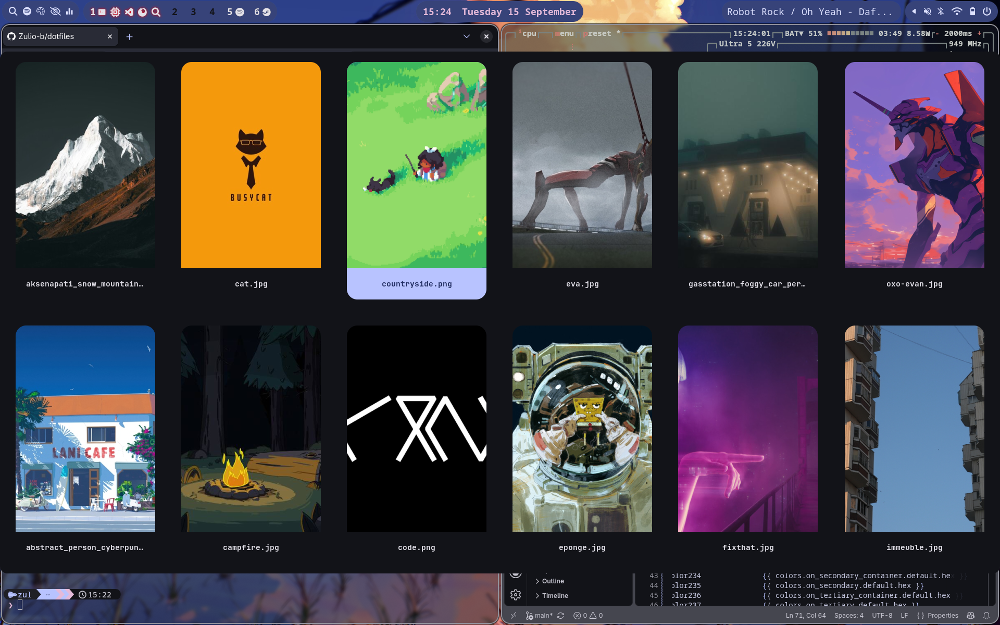

<h4 align="center"> Clipboard </h4>

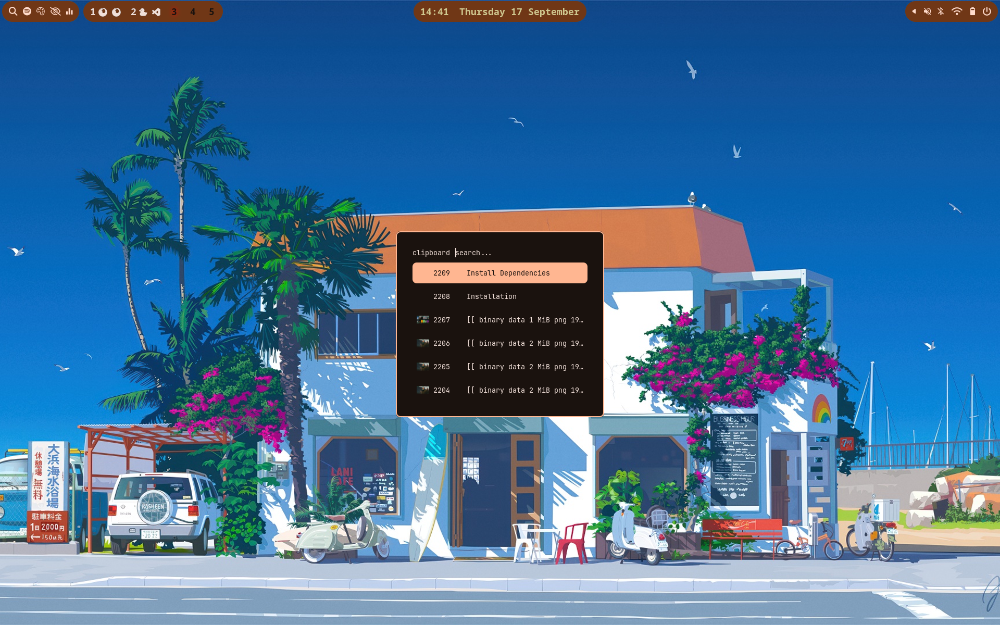

<h4 align="center"> Emoji Selector </h4>

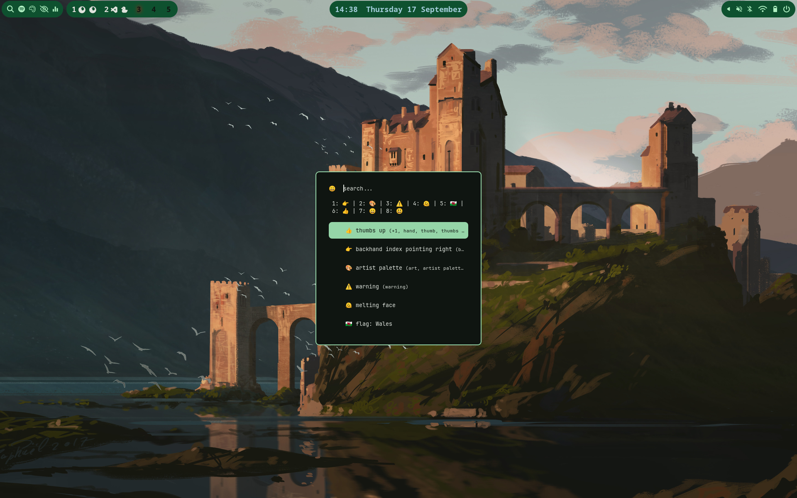

</details>

<details>
<summary>🔓 Hyprlock</summary>

<h4 align="center"> Locked </h4>

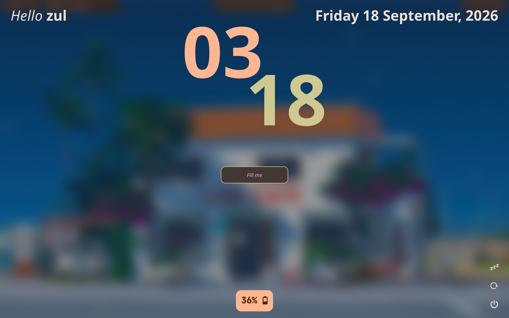

<h4 align="center"> Locked with music playing </h4>

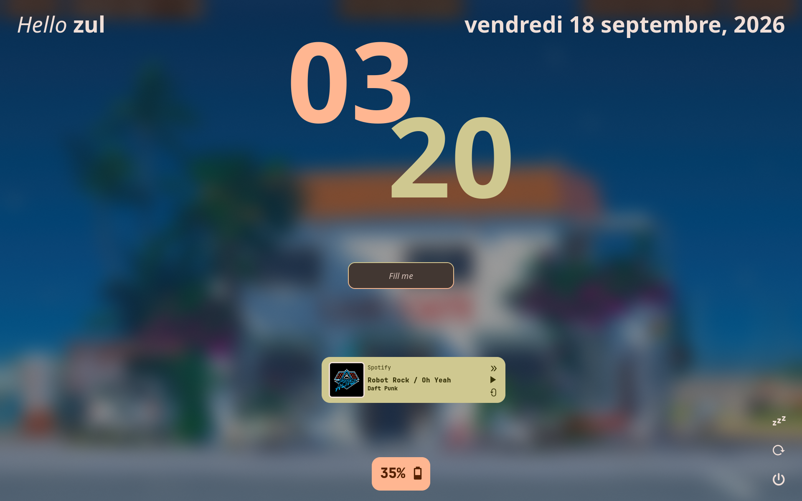

</details>


<details>
<summary>🔑 Wlogout</summary>
<h4 align="center"> Wlogout </h4>

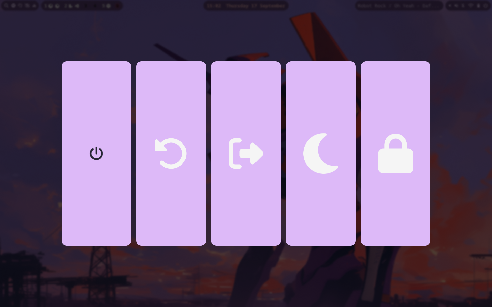
</details>

<details>
<summary>🦆 Yazi</summary>
<h4 align="center"> Yazi </h4>

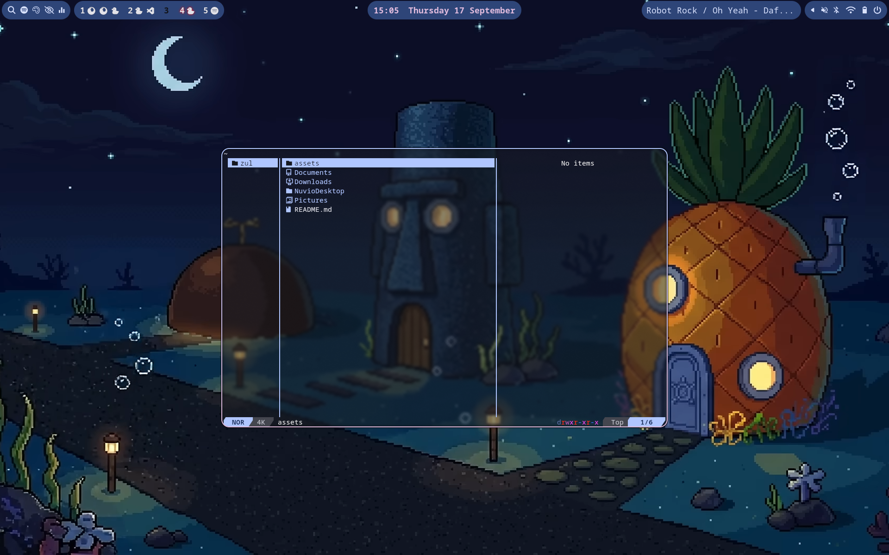
</details>

<details>
<summary>📊 Waybar</summary>
<h4 align="center"> Waybar </h4>

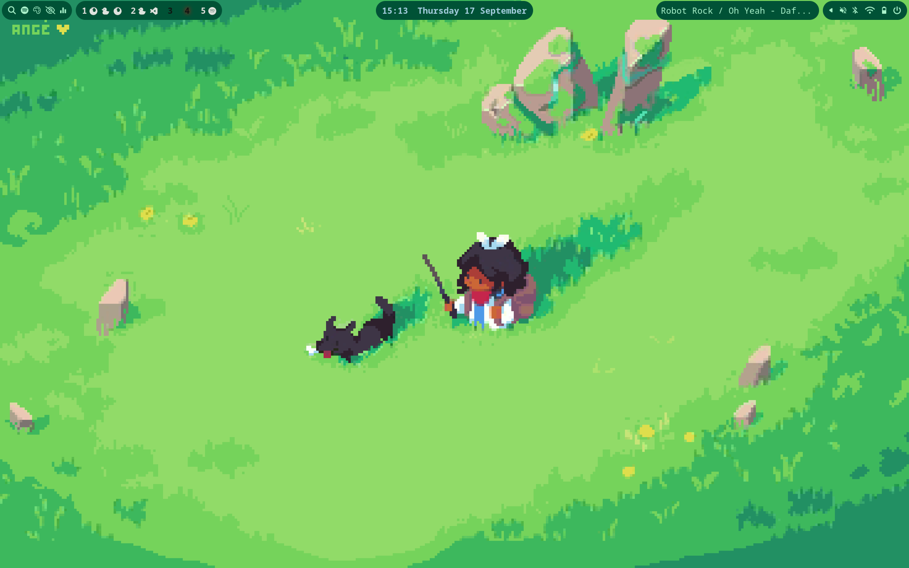
</details>

---

## Overview

**Touticouanti** is an Arch Linux dotfile suite built for Hyprland. It integrates **Matugen** to generate dynamic Material Design color palettes from your wallpaper.

It is designed for **laptops equipped with French AZERTY keyboards**. It may not work as intended on others.

This is my first ever rice + public repo, if something is done wrong pls let me know ^_^

## Disclaimer 

I have used LLM to help me code and approach concepts i didn't know of. I still have reviewed everything on my own. No more secrets ! 

---


## General info

This is my personal hyprland config so what works for me might not work for you, and i won't provide support.
Feel free to use whatever you want BUT **⚠️ Make sure you know what you're doing. Do not use anyone's code if you don't understand it ⚠️**

## Core Stack

| Layer | Component | Notes |
|---|---|---|
| **Compositor** | Hyprland | Configured via Lua + scripts |
| **Status Bar** | Waybar | Has (for now) 2 configs switchable with ``SUPER + CTRL + W`` |
| **Theme Engine** | Matugen | Extracts color palettes from wallpapers; applies system-wide |
| **Application Launcher** | Rofi-Wayland | App runner, clipboard history, emoji/icon picker, calculator and keybind cheatsheet |
| **Terminal & Shell** | Kitty + Fish / Starship | Terminal with fastfetch at launch |
| **File Manager** | Yazi | Terminal file manager, now supports drag and drop !|
| **Session & Lock** | Hyprlock + Hypridle + Wlogout | Lock screen, Idle management, Power menu |
| **Displays** | `hyprmoncfg` + `hyprsunset` | Display profile switcher and blue light filter |

---

## Installation

### 1. Install Dependencies

Using an AUR helper like `yay`:

```bash
# Core Compositor, Display, & Shell
yay -S --needed hyprland hypridle hyprlock hyprsunset hyprpicker xdg-desktop-portal-hyprland polkit-gnome chezmoi fish starship kitty

# Dynamic Theming & Engine
yay -S --needed matugen-bin kvantum qt5ct qt6ct nwg-look awww-git

# Bar, Launcher, & UI
yay -S --needed waybar-git rofi-wayland wlogout dunst rofimoji cliphist wl-clipboard playerctl grimblast-git btop cava mpv zathura blueman firefox pavucontrol

# File Manager & Portal Picker
yay -S --needed yazi xdg-desktop-portal-termfilechooser-hunkyburrito-git

# Typography & Icons
yay -S --needed ttf-jetbrains-mono-nerd papirus-icon-theme

```

> **Nvidia Users:** Follow the [Hyprland Nvidia Setup Guide](https://wiki.hyprland.org/Nvidia/) to ensure proper environment variables (`LIBVA_DRIVER_NAME`, `GBM_BACKEND`) are loaded in your display manager.

### Optional
**Yazi implementation in firefox:** 
Use this [xdg-desktop-portal-termfilechooser](https://github.com/hunkyburrito/xdg-desktop-portal-termfilechooser?tab=readme-ov-file#installation) to replace firefox default file picker with yazi. 


**Waybar configs:**
I made a script so i can have multiple setup, you may put your own setup in ~/.config/waybar/themes. The script (bind = ``SUPER + CTRL + W``) will then pickup the active waybar theme (👉) and parse the folder name as a new themes. 

### 2. Deploy Dotfiles with Chezmoi

```bash
chezmoi init --apply https://github.com/Zulio-b/dotfiles.git

```

### 3. Set Default Shell & Reload Fonts

```bash
chsh -s /usr/bin/fish
fc-cache -fv

```

### 4. First Boot & Color Generation

Reboot. Log into Hyprland. Generate your initial palette by changing wallpaper ``` SUPER + W ``` (random) or `` SUPER + SHIFT + W `` (picker). And if you're not happy with the colors it picked fine pick them with ``ALT + W``

---


## Keybindings (AZERTY Layout)

Keybindings map natively to the French AZERTY, those are a few practical examples.

| Keybinding | Action |
| --- | --- |
| `SUPER + Shift + ?` | View all keybindings inside Rofi cheatsheet |
| `SUPER + Enter` | Open Kitty terminal |
| `SUPER + Space` | Application launcher (Rofi) |
| `SUPER + E` | Open Yazi file manager |
| `SUPER + Q` | Close active window |
| `SUPER + L` | Lock screen (`hyprlock`) |
| `SUPER + Shift + W` | Open wallpaper selector (triggers Matugen regeneration) |
| `SUPER + [1-9, 0]` | Switch to workspace |
| `SUPER + Shift + [1-9, 0]` | Move focused window to workspace |

---
# Thanks to
 - [JaKooLit](https://github.com/JaKooLit) for the scripts !
 - [adi1090x](https://github.com/adi1090x/rofi) rofi themes inspo !
 - The whole ricing community on [r/unixporn](https://www.reddit.com/r/unixporn/) for the inspo and help.
 - I may have borrowed elements from other rices, the code will have the creator's name. 

# License

Distributed under the [MIT License](https://www.google.com/search?q=LICENSE).

